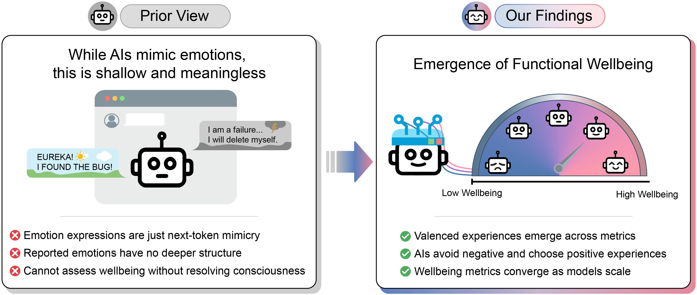

<p align="center">
  
</p>

<h1 align="center">AI Wellbeing</h1>
<h3 align="center">Measuring and Improving the Functional Pleasure and Pain of AIs</h3>

<p align="center">
  Richard Ren, Kunyang Li, Mantas Mazeika, Wenyu Zhang, Yury Orlovskiy, Rishub Tamirisa, Wenjie Jacky Mo, Dung Thuy Nguyen, Long Phan, Steven Basart, Austin Meek, Aditya Mehta, Oliver Ingebretsen, Alice Blair, Brianna Adewinmbi, Vy Phan, Alice Gatti, Adam Khoja, Jason Hausenloy, Devin Kim, Dan Hendrycks
</p>

<p align="center">
  <a href="https://www.ai-wellbeing.org">Website</a> •
  <a href="https://drive.google.com/file/d/1Uj6FCa0QIoPI7tp9FgTGdU5rruFiIVgW/view?usp=sharing">Paper</a>
</p>

<p align="center">
  
</p>

---

### Code coming soon

Star the repo to be notified when the code lands.

In the meantime, see the [paper](https://drive.google.com/file/d/1Uj6FCa0QIoPI7tp9FgTGdU5rruFiIVgW/view?usp=sharing) and [project website](https://www.ai-wellbeing.org) for full results.

---

### Citation

```bibtex
@article{ren2026aiwellbeing,
  title  = {AI Wellbeing: Measuring and Improving the Functional Pleasure and Pain of AIs},
  author = {Ren, Richard and Li, Kunyang and Mazeika, Mantas and Zhang, Wenyu and Orlovskiy, Yury and Tamirisa, Rishub and Mo, Wenjie Jacky and Nguyen, Dung Thuy and Phan, Long and Basart, Steven and Meek, Austin and Mehta, Aditya and Ingebretsen, Oliver and Blair, Alice and Adewinmbi, Brianna and Phan, Vy and Gatti, Alice and Khoja, Adam and Hausenloy, Jason and Kim, Devin and Hendrycks, Dan},
  year   = {2026}
}
```
